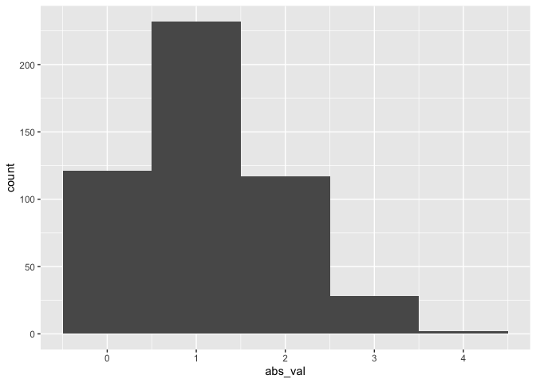

Simple document
================
Irene
2021

true

I’m an R Markdown document!

# Section 1

Here’s a **code chunk** that samples from a *normal distribution*:

``` r
setwd("~/Desktop/DATA SCIENCE")
samp = rnorm(100)
length(samp)
```

    ## [1] 100

# Section 2

I can take the mean of the sample, too! The mean is -0.010915.

# Section 3

Lets write a new code chunk

``` r
library(tidyverse)
```

    ## ── Attaching packages ─────────────────────────────────────── tidyverse 1.3.1 ──

    ## ✓ ggplot2 3.3.5     ✓ purrr   0.3.4
    ## ✓ tibble  3.1.4     ✓ dplyr   1.0.7
    ## ✓ tidyr   1.1.3     ✓ stringr 1.4.0
    ## ✓ readr   2.0.1     ✓ forcats 0.5.1

    ## ── Conflicts ────────────────────────────────────────── tidyverse_conflicts() ──
    ## x dplyr::filter() masks stats::filter()
    ## x dplyr::lag()    masks stats::lag()

``` r
set.seed(12)

learning_df = 
  tibble(
    sample =rnorm(500, mean =1),
    gr_than_0 = sample > 0,
    abs_val = abs(sample))

ggplot(learning_df, aes(x= abs_val)) + geom_histogram(binwidth = 1)
```

<!-- -->

\`\`\`
